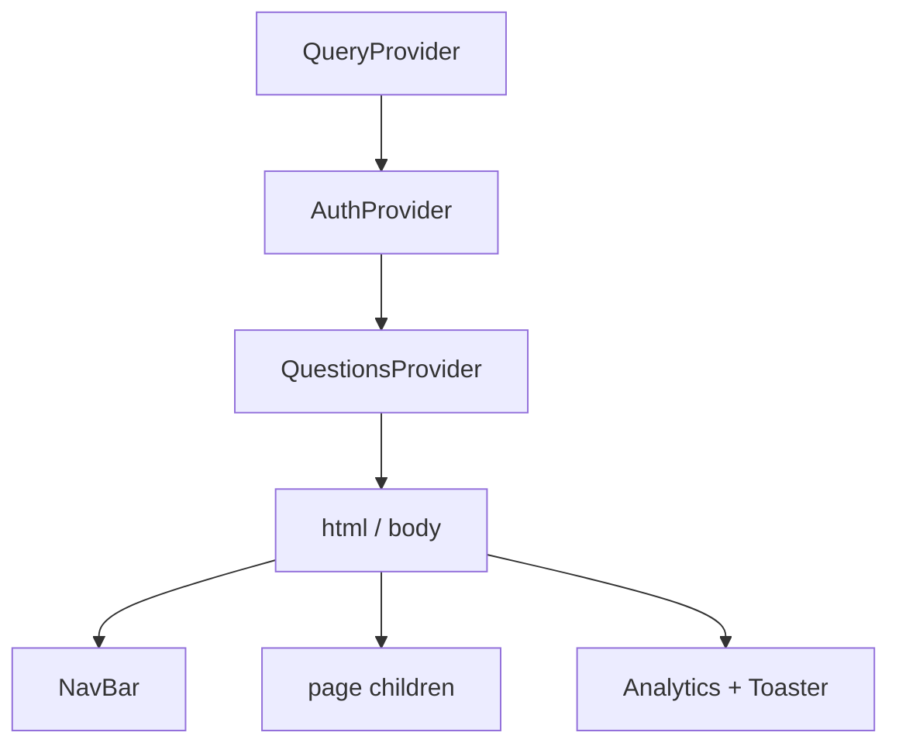
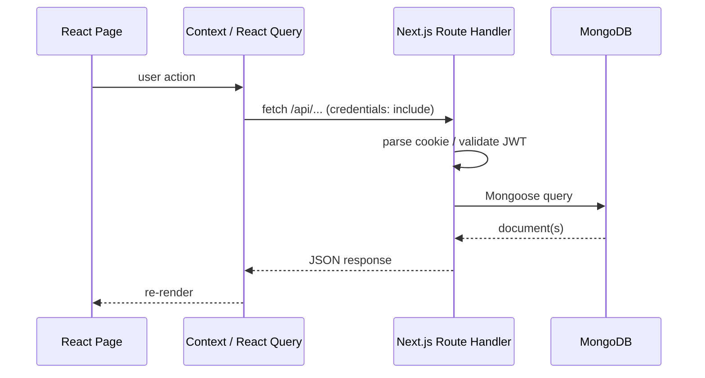

# 01 — Architecture

High-level overview of the Studyseed Admin Dashboard: what it is, how it is
structured, and how requests flow through the stack.

## What this app is

The admin dashboard is a **Next.js full-stack application** used by Studyseed
staff to:

1. **Create learner accounts** — auto-generated user IDs, course/topic enrollment,
   initialized progress objects.
2. **Browse and delete learners** — paginated search across the `users` collection.
3. **Edit quiz questions** — per course, topic, and module, across eight editable
   question types.

Unlike the game client, this app talks **directly to MongoDB** through Next.js
Route Handlers — it does not proxy through `ges-programme-server`.

## Tech stack

| Layer | Technology |
| --- | --- |
| Framework | Next.js 15.2 (App Router, Turbopack in dev) |
| UI | React 19, Tailwind CSS v4, shadcn/ui, lucide-react |
| Forms | react-hook-form + @hookform/resolvers + Zod |
| Server/async state | TanStack React Query v5 |
| Database | Mongoose 8 → MongoDB |
| Auth | jose (JWT HS256), bcryptjs, httpOnly cookies |
| Toasts | sonner |
| Analytics | @vercel/analytics |
| Testing | Jest 29 + Testing Library + next/jest |
| Release | commit-and-tag-version (Conventional Commits) |

## Provider tree



Defined in `src/app/layout.tsx`. All pages share the same provider stack.

- **QueryProvider** — TanStack Query client (mutations, cached fetches).
- **AuthProvider** — validates JWT on mount via `GET /api/auth`.
- **QuestionsProvider** — course/topic/module selection and question CRUD state.

## Directory layout

```
src/
├── app/                    # Next.js App Router
│   ├── api/                # Route Handlers (BFF → MongoDB)
│   ├── login/              # Admin login page
│   ├── register/           # Admin self-registration (unprotected)
│   ├── manage/             # Protected admin area
│   │   ├── create-user/
│   │   ├── users-overview/
│   │   └── questions/      # Question browser + editors
│   ├── provider/           # QueryProvider
│   ├── layout.tsx          # Root layout + providers
│   └── page.tsx            # Public landing
├── components/
│   ├── ui/                 # shadcn primitives
│   ├── NavBar.tsx
│   └── UserTable.tsx
├── context/
│   ├── AuthContext.tsx
│   └── QuestionsContext.tsx
├── enums/                  # apiPaths, courses, pagePaths, topics
├── lib/                    # auth, schemas, mongodb, helpers
├── Models/                 # Mongoose models (Admin, User, Question)
├── constants/
└── middleware.ts           # Route protection
```

## Routing

| Path | Access | Purpose |
| --- | --- | --- |
| `/` | Public | Landing page with CTAs |
| `/login` | Public (redirect if authed) | Admin login |
| `/register` | Public | Create admin account |
| `/manage` | Protected | Management hub |
| `/manage/create-user` | Protected | Create learner |
| `/manage/users-overview` | Protected | Paginated user list |
| `/manage/questions` | Protected | Question editor |

Route constants live in `src/enums/pagePaths.enum.ts`. All hrefs use **absolute
paths** (leading `/`) to avoid Next.js relative-link nesting bugs.

### Middleware

`src/middleware.ts` protects `/manage/:path*` and `/login`:

- Unauthenticated access to `/manage/*` → redirect to `/login`.
- Authenticated access to `/login` → redirect to `/manage`.
- JWT verified with `jose` (`verifyAuthToken`).

Home (`/`), register (`/register`), and all `/api/*` routes are **outside**
middleware.

## Data flow pattern



## Courses and topics

| Course | Collections | Topics |
| --- | --- | --- |
| `GES` | `ges_literacy`, `ges_numeracy` | LITERACY, NUMERACY |
| `GES2` | `ges2_literacy`, `ges2_numeracy` | LITERACY, NUMERACY |
| `GLP` | `glp_literacy`, `glp_numeracy` | LITERACY, NUMERACY |
| `MACKLE` | `mackle_literacy` | LITERACY only |

Enums: `src/enums/courses.enum.ts`, `src/enums/topics.enum.ts`.

## Scripts

| Script | Command | Purpose |
| --- | --- | --- |
| `dev` | `next dev --turbopack -p 8000` | Dev server on port 8000 |
| `build` | `next build` | Production build |
| `start` | `next start` | Production server |
| `lint` | `next lint` | ESLint |
| `test` | `jest` | Unit tests |
| `release` | `commit-and-tag-version` | Semver + CHANGELOG |

## CI

`.github/workflows/unit-tests.yml` runs `npm ci` + `jest` on push.
