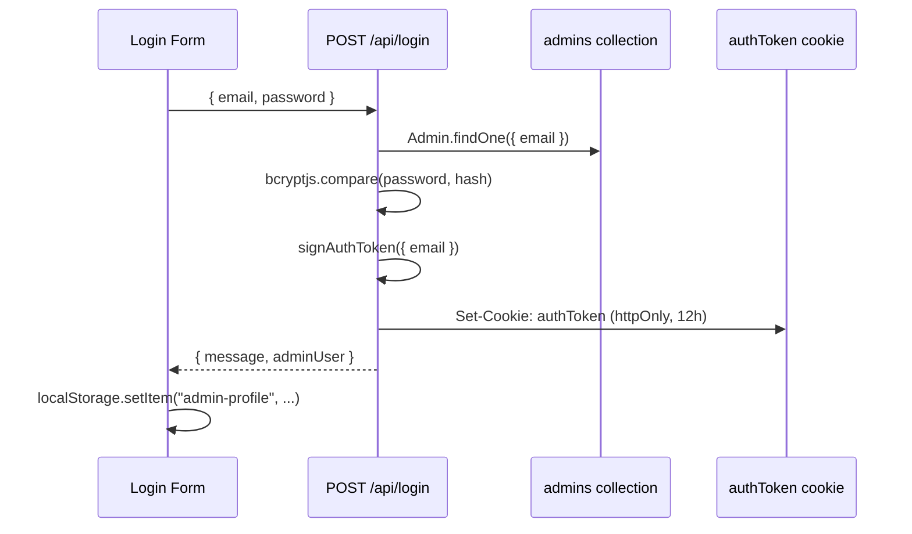
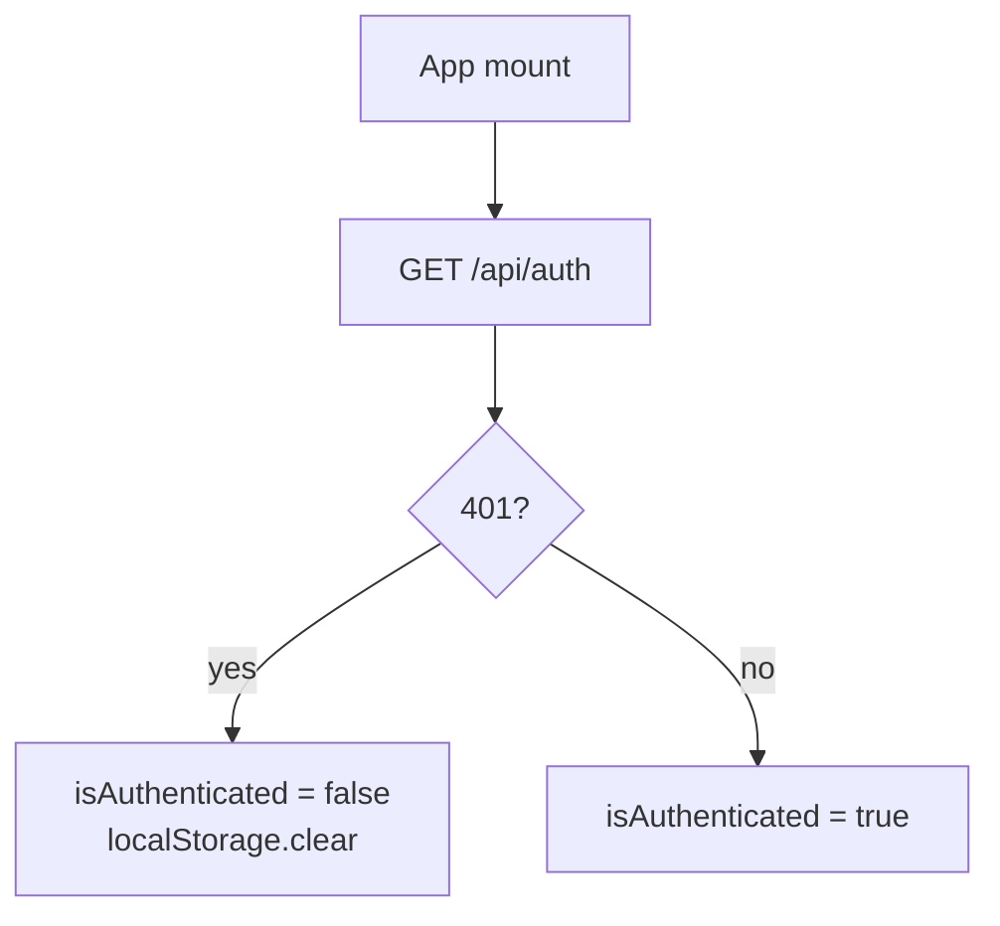

# 02 — Auth & Routing

How admin authentication works, how routes are protected, and how session state
flows between server and client.

## Auth model overview

| Actor | Auth method | Storage |
| --- | --- | --- |
| **Admin** (this dashboard) | Email + password → JWT | httpOnly `authToken` cookie (12h) |
| **Learner** (game client) | User ID only | `localStorage` on client; no password |

This dashboard authenticates **admins only**. Learners are data records created
by admins — they do not log into this app.

## Login flow



### Key files

| File | Role |
| --- | --- |
| `src/app/login/components/Login.tsx` | Login form UI |
| `src/app/api/login/route.ts` | Credential check + cookie |
| `src/lib/auth.ts` | `signAuthToken`, `verifyAuthToken`, JWT secret |
| `src/Models/Admin.ts` | Mongoose model → `admins` collection |
| `src/lib/adminSchema.ts` | Zod schema for login payload |

### JWT details

- Library: **jose** (HS256).
- Expiry: **12 hours** (`setExpirationTime("12h")`).
- Payload: `{ email }`.
- Secret: `TextEncoder().encode(JSON.stringify(process.env.JWT_SECRET))`.

> **Note:** Encoding the env var via `JSON.stringify` is unusual. See
> [improvements/01-security.md](./improvements/01-security.md).

### Cookie flags

```typescript
serialize("authToken", token, {
  httpOnly: true,
  secure: process.env.NODE_ENV === "production",
  maxAge: 60 * 60 * 12,
  path: "/",
});
```

## Session validation

On every page load, `AuthContext` calls `GET /api/auth`:



`AuthContext` does **not** store the JWT — only a boolean `isAuthenticated`.
Admin display info (username, email) is cached in `localStorage` as
`admin-profile` for the NavBar.

## Logout flow

1. `GET /api/logout` — clears `authToken` cookie.
2. Client calls `localStorage.clear()`.
3. Redirect to `/login`.

## Middleware protection

`src/middleware.ts` runs on `/manage/:path*` and `/login`:

| Request | Condition | Result |
| --- | --- | --- |
| `GET /manage/*` | No cookie | Redirect → `/login` |
| `GET /manage/*` | Invalid/expired JWT | Redirect → `/login` |
| `GET /manage/*` | Valid JWT | Allow |
| `GET /login` | Valid JWT | Redirect → `/manage` |
| `GET /login` | No/invalid JWT | Allow |

Middleware uses `jwtVerify` directly for the login-page redirect check and
`verifyAuthToken` for protected routes.

## Admin registration

`POST /api/register` creates a new document in the `admins` collection.

- **Currently unprotected** — no auth required.
- UI at `/register` uses basic inline styles (not shadcn).
- Passwords are bcrypt-hashed before save.

See [improvements/01-security.md](./improvements/01-security.md) for hardening
recommendations.

## API route auth patterns

Not all API routes validate the JWT equally:

| Route | Cookie check | JWT verify |
| --- | --- | --- |
| `POST /api/login` | N/A | N/A |
| `GET /api/auth` | Yes | Yes (`await`) |
| `POST /api/create-new-user` | Yes | **No** |
| `GET /api/get-paginated-users` | Yes | **Bug: missing `await`** |
| `DELETE /api/delete-user` | Yes | **No** |
| `PUT /api/update-question` | Yes | **No** |
| `GET /api/get-questions` | Yes | Yes |
| `POST /api/register` | **None** | **None** |
| `POST /api/migrate-users-avatars` | **None** | **None** |

Several routes only check that a cookie **exists**, not that it is valid. This
is a known security gap documented in the improvements register.

## Environment variables

| Variable | Required | Purpose |
| --- | --- | --- |
| `MONGODB_URI` | Yes | MongoDB connection string |
| `JWT_SECRET` | Yes | Secret for signing/verifying JWTs |
| `NODE_ENV` | Auto | Controls `secure` cookie flag |

See `.env.example` at the repo root.
