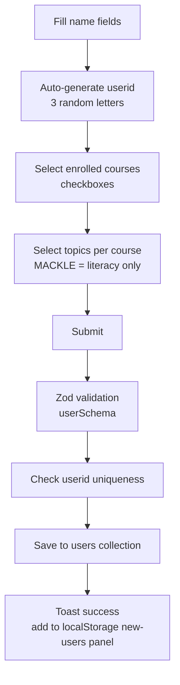

# 03 — User Management

How learner accounts are created, listed, searched, and deleted.

## User document shape

Stored in the `users` MongoDB collection (`src/Models/User.ts`):

| Field | Type | Notes |
| --- | --- | --- |
| `userid` | `string` | Auto-generated (3 random letters). Login ID for game client |
| `first_name` | `string` | |
| `last_name` | `string` | |
| `enrolled_courses` | `Course[]` | GES, GES2, GLP, MACKLE |
| `courses` | `Topic[]` | LITERACY, NUMERACY — legacy name ("topics") |
| `progress` | `Partial<ProgressModel>` | Initialized empty per enrolled course |
| `avatar` | `string?` | Defaults to `BASE_AVATAR` |
| `unlockedAvatars` | `string[]` | Defaults to `[]` |

### Progress initialization

When creating a user, `initializeProgress()` in `src/lib/helperFunctions.ts`
builds an empty progress tree:

```typescript
// For each enrolled course:
{
  [course]: {
    LITERACY: {},
    NUMERACY: {},
  }
}
```

On `ges-programme-server`, a similar hook runs in a Mongoose pre-save middleware.
The admin dashboard initializes progress **client-side** before insert.

## Create user flow

**Page:** `/manage/create-user`  
**Component:** `src/app/manage/create-user/components/CreateUserForm.tsx`  
**API:** `POST /api/create-new-user`



### Form details

- **react-hook-form** with `zodResolver(userSchema)`.
- User ID generated via `generateRandomLetters(3)` — uppercase A–Z.
- Course checkboxes use `useFieldArray` for dynamic enrollment.
- MACKLE course restricts topic selection to LITERACY only
  (`coursesWithOnlyLiteracy` constant in form).
- On success, user is appended to `localStorage` key `new-users` for the
  side-panel "recently added" list.

### API validation

`POST /api/create-new-user`:

1. Checks `authToken` cookie exists (does not verify JWT — see security docs).
2. Validates body with `userSchema` (Zod).
3. Checks `userid` uniqueness (`409` if duplicate).
4. Maps `enrolled_courses` from `{ course }[]` to `Course[]`.
5. Saves via `new User(updatedReqBody).save()`.

## Users overview flow

**Page:** `/manage/users-overview`  
**Component:** `src/components/UserTable.tsx`  
**API:** `GET /api/get-paginated-users`

### Features

- Server-side pagination (`page`, `limit` query params).
- Server-side search (`searchTerm` — regex on `userid`, `first_name`, `last_name`).
- Copy userid to clipboard.
- Delete with confirmation dialog.

### Query key

```typescript
queryKey: ["all-users", searchTerm, page]
```

> **Known bug:** `CreateUserForm` invalidates `["users"]` on success, but the
> overview uses `["all-users", ...]`. New users may not appear until manual
> refresh. See [improvements/03-code-quality.md](./improvements/03-code-quality.md).

## Delete user flow

**API:** `DELETE /api/delete-user?userid=...`

1. Cookie presence check.
2. `User.findOneAndDelete({ userid })`.
3. React Query invalidates `["all-users"]`.

Deletion is permanent — no soft-delete or audit trail.

## Relationship to game client

Learners created here are immediately available to `ges-programme-server`:

- Login: `POST /authdb/login` with `userid`.
- Profile: `GET /mdb-read/find?userid=...`.
- Progress updates happen on the game client, not in this dashboard.

The admin dashboard does **not** display or edit learner progress.

## Unused endpoint

`GET /api/get-all-users` returns all users without pagination. It is not
referenced by any UI component — likely a legacy endpoint.
