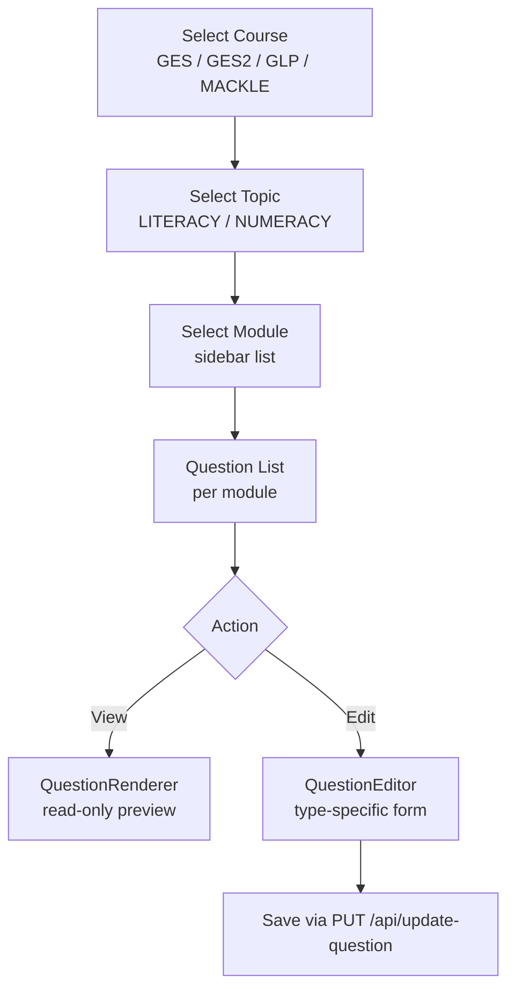

# 04 — Question Management

How quiz questions are browsed, previewed, and edited across courses, topics,
and modules.

## Overview

**Page:** `/manage/questions`  
**State:** `QuestionsContext` (`src/context/QuestionsContext.tsx`)  
**API:** `GET /api/get-questions`, `PUT /api/update-question`

The question editor is **edit-only** — there is no UI to create new questions,
modules, or delete existing ones. Content is assumed to be seeded externally
(e.g. direct DB import or server-side scripts).

## Navigation hierarchy



### Component map

| Component | File | Role |
| --- | --- | --- |
| `QuestionManager` | `questions/components/QuestionManager.tsx` | Course/topic/module sidebar + list |
| `QuestionRenderer` | `questions/components/QuestionRenderer.tsx` | Read-only preview per type |
| `QuestionEditor` | `questions/components/QuestionEditor.tsx` | Routes to type-specific form |
| `MCQForm` | `questions/components/MCQForm.tsx` | Multiple choice |
| `MSQForm` | `questions/components/MSQForm.tsx` | Multiple selection |
| `TrueFalseForm` | `questions/components/TrueFalseForm.tsx` | True/false |
| `MatchingForm` | `questions/components/MatchingForm.tsx` | Matching pairs |
| `FillBlankForm` | `questions/components/FillBlankForm.tsx` | Fill in the blank |
| `DnDForm` | `questions/components/DnDForm.tsx` | Drag and drop (sorting) |
| `TndForm` | `questions/components/TndForm.tsx` | Tap and drop (individual + categories) |
| `FormActionButtons` | `questions/components/FormActionButtons.tsx` | Cancel / Save |

## Supported question types

| `question_style` | Editable | Preview | Notes |
| --- | --- | --- | --- |
| `multiple_choice_question` | Yes | Yes | `possible_answers[]`, `correct_answer: string` |
| `multiple_selection` | Yes | Yes | `possible_answers[]`, `correct_answer: string[]` |
| `true_false` | Yes | Yes | `correct_answer: boolean` |
| `matching` | Yes | Yes | `options[]`, `answers[]`, `correct_answer: Record` |
| `fill_in_the_blank` | Yes | Yes | `display_info`, `num_of_text_box`, `capitalisation` |
| `drag_and_drop` | Yes | Yes | `correct_answer: string[]` (ordered) |
| `tnd` | Yes | Yes | Individual or Categories (`tndStyle` enum) |
| `dummy` | **No** | Yes | Placeholder questions — view only |
| `streak_choice` | **No** | **No** | Exists in server/client but **not in admin** |

See [improvements/02-data-model-sync.md](./improvements/02-data-model-sync.md) for
`streak_choice` drift.

## MongoDB document structure

Each course/topic maps to a collection with a single document:

```typescript
{
  modules: [
    {
      module_id: "EL1",
      questions: [
        {
          question_number: "1",
          question_style: "multiple_choice_question",
          question_text: "...",
          hint: "...",
          // ... type-specific fields
        }
      ]
    }
  ]
}
```

Mongoose uses `strict: false` on the question sub-schema so different question
types can coexist in the same array.

### Collection mapping

| Course | Topic | Collection |
| --- | --- | --- |
| GES | NUMERACY | `ges_numeracy` |
| GES | LITERACY | `ges_literacy` |
| GES2 | NUMERACY | `ges2_numeracy` |
| GES2 | LITERACY | `ges2_literacy` |
| GLP | NUMERACY | `glp_numeracy` |
| GLP | LITERACY | `glp_literacy` |
| MACKLE | LITERACY | `mackle_literacy` |

Defined in `src/Models/QuestionModel.ts` and mirrored in
`src/app/api/update-question/updateQuestion.ts`.

## Edit flow

1. Admin selects course → topic → module → question → Edit.
2. `QuestionEditor` renders the type-specific form pre-filled with question data.
3. Form validates with Zod (`questionSchema.ts` — discriminated union on `question_style`).
4. On save, `QuestionsContext.handleUpdateQuestion` builds `UpdateQuestionPayload`:

```typescript
{
  course, topic, module_id, question_number,
  updates: ZodQuestionSchema  // validated form data
}
```

5. `PUT /api/update-question` → `updateQuestion()` uses MongoDB `$set` with
   `arrayFilters` to update the nested question in-place:

```typescript
Collection.updateOne(
  {},
  { $set: { "modules.$[u].questions.$[q].fieldName": value, ... } },
  { arrayFilters: [
      { "u.module_id": module_id },
      { "q.question_number": question_number }
  ]}
);
```

6. On success, React Query invalidates `["questions-by-course-topic", topic, course]`.

## Validation

Client-side Zod schemas in `src/lib/questionSchema.ts` mirror the TypeScript
interfaces in `src/lib/questionTypes.ts`. Each form uses `zodResolver` with
the appropriate sub-schema.

Server-side validation on `PUT /api/update-question` is minimal — it trusts the
client payload shape. Adding server-side Zod validation is recommended (see
improvement plans).

## React Query cache

```typescript
queryKey: ["questions-by-course-topic", selectedTopic, selectedCourse]
staleTime: 5 minutes
placeholderData: keepPreviousData
```

## Known UI bugs

- `selectTopic(undefined)` and `selectModule(undefined)` in `QuestionsContext`
  do not clear state — callbacks only call `setState` when the argument is truthy.
- Stale TODO in `manage/questions/page.tsx` references creating an API route that
  already exists.
