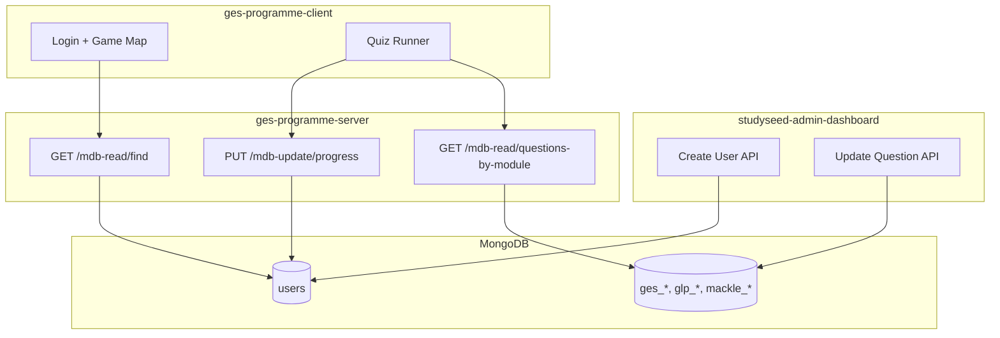

# 05 — Data & API

MongoDB collections, Mongoose models, API route reference, and data contracts
shared with the GES ecosystem.

## Ecosystem data flow



The admin dashboard and game server are **parallel writers/readers** of the same
database. There is no HTTP coupling between admin and server.

## MongoDB connection

`src/lib/mongodb.ts` — singleton connection pattern for Next.js:

- Reads `process.env.MONGODB_URI`.
- Caches the connection across hot reloads in development.
- Called at the top of every Route Handler before queries.

## Collections

### `users`

| Model | File | Notes |
| --- | --- | --- |
| `User` | `src/Models/User.ts` | Explicit collection name `"users"` |

Key fields documented in [03 — User Management](./03-user-management.md).

**Drift vs server:** `ges-programme-server` enforces `userid` unique index in
the schema; the admin model does not. Duplicate user IDs are only caught at
application level during create.

### `admins`

| Model | File | Notes |
| --- | --- | --- |
| `Admin` | `src/Models/Admin.ts` | Email + bcrypt password hash |

Only used by this dashboard. Not shared with game server.

### Question collections

One document per collection, containing all modules and their questions.
See [04 — Question Management](./04-question-management.md) for structure.

| Collection | Course | Topic |
| --- | --- | --- |
| `ges_numeracy` | GES | NUMERACY |
| `ges_literacy` | GES | LITERACY |
| `ges2_numeracy` | GES2 | NUMERACY |
| `ges2_literacy` | GES2 | LITERACY |
| `glp_numeracy` | GLP | NUMERACY |
| `glp_literacy` | GLP | LITERACY |
| `mackle_literacy` | MACKLE | LITERACY |

`ges-programme-server` also has an `admin` questions collection (`Course.ADMIN`)
that is **not** managed by this dashboard.

## API route reference

All paths are relative to the Next.js origin (e.g. `http://localhost:8000`).

### Auth

| Method | Path | Auth | Request | Response |
| --- | --- | --- | --- | --- |
| `POST` | `/api/login` | None | `{ email, password }` | `{ message, adminUser }` + Set-Cookie |
| `GET` | `/api/logout` | None | — | Clears cookie |
| `GET` | `/api/auth` | Cookie | — | `{ user: decoded }` or `401` |
| `POST` | `/api/register` | **None** | `{ email, password, username }` | `{ message }` |

### Users

| Method | Path | Auth | Request / Query | Response |
| --- | --- | --- | --- | --- |
| `POST` | `/api/create-new-user` | Cookie | `ZodUserSchema` body | `{ message, savedResult }` |
| `GET` | `/api/get-paginated-users` | Cookie | `?searchTerm&page&limit` | `{ data: { users, totalUsers, pageNumber, limitNumber } }` |
| `GET` | `/api/get-all-users` | Cookie | — | All users (unused in UI) |
| `DELETE` | `/api/delete-user` | Cookie | `?userid=...` | `{ message }` |

### Questions

| Method | Path | Auth | Request / Query | Response |
| --- | --- | --- | --- | --- |
| `GET` | `/api/get-questions` | Cookie + JWT | `?course&topic` | `{ data: QuestionsPayload }` |
| `PUT` | `/api/update-question` | Cookie | `UpdateQuestionPayload` body | `{ message, result }` |

### Migrations (one-off)

| Method | Path | Auth | Purpose |
| --- | --- | --- | --- |
| `POST` | `/api/migrate-users-avatars` | **None** | Set `avatar` + `unlockedAvatars` on all users |

### Client API path enum

`src/enums/apiPaths.enum.ts` (`DashboardAPIPath`) — not all routes are listed
(e.g. `get-all-users`, `register`, `logout`, `auth` are called with string literals).

## Type definitions

| File | Contents |
| --- | --- |
| `src/lib/questionTypes.ts` | TS interfaces for all question shapes |
| `src/lib/questionSchema.ts` | Zod schemas (discriminated union on `question_style`) |
| `src/lib/adminSchema.ts` | Admin login + user creation schemas |
| `src/lib/types.ts` | `ProgressModel`, `UpdateQuestionPayload` |
| `src/enums/courses.enum.ts` | `GES`, `GES2`, `GLP`, `MACKLE` |
| `src/enums/topics.enum.ts` | `LITERACY`, `NUMERACY` |

### Progress model

```typescript
type ProgressModel = Record<Course, Record<Topic, Record<moduleName, [score, date][]>>>
```

Scores are tuples of `[number, string]` (score + ISO date). Updated by the game
client via `ges-programme-server`, not by this dashboard.

## Sync checklist with ges-programme-server

When adding or changing a question type or user field:

| Step | Admin dashboard | ges-programme-server | ges-programme-client |
| --- | --- | --- | --- |
| 1 | Update `questionTypes.ts` | Update `src/types/question.ts` | Update `schemas/questions.ts` |
| 2 | Update `questionSchema.ts` | — | Update `correctAnswerChecker.ts` |
| 3 | Add form + renderer | — | Add `QuizRenderer/` component |
| 4 | Update `QuestionEditor` switch | Update read routes if needed | Update `QuestionRendererWrapper` |

There is **no shared npm package** — all three repos must be updated independently.

### Current known drift

| Feature | Admin | Server | Client |
| --- | --- | --- | --- |
| `streak_choice` | Missing | Supported | Supported |
| `MACKLE` course | Supported | Missing | Missing |
| `userid` unique index | App-level only | Schema-level | N/A |
| Zod validation | Client forms only | None | API boundary |

See [improvements/02-data-model-sync.md](./improvements/02-data-model-sync.md).
