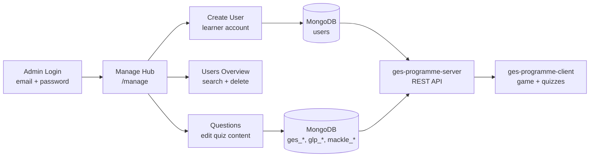

# Studyseed Admin Dashboard — Documentation

An internal admin tool for the **Studyseed Gamified Learning Programme (SSGLP)**.
Administrators create learner accounts and edit quiz questions stored in MongoDB.
Learners created here are consumed by the game client (`ges-programme-client`) via
`ges-programme-server`.

This documentation is written for engineers and AI agents who will maintain or
extend the app.

## Documents

| Doc | Contents |
| --- | --- |
| [**Engineering Guide**](./engineering-guide/README.md) | **Authoritative current-state reference** — patterns, conventions, ecosystem integration. Start here. |
| [01 — Architecture](./01-architecture.md) | Tech stack, provider tree, routing, directory layout |
| [02 — Auth & Routing](./02-auth-and-routing.md) | Admin login, JWT cookies, middleware, session flow |
| [03 — User Management](./03-user-management.md) | Create learners, paginated overview, delete |
| [04 — Question Management](./04-question-management.md) | Course/topic/module browser, editors, question types |
| [05 — Data & API](./05-data-and-api.md) | MongoDB collections, API routes, data models |
| [Improvements & Tech Debt](./improvements/README.md) | Gaps, security issues, schema drift (dated, by area) |
| [Action Plans](./plans/README.md) | Phased remediation plans (low→high risk) |

> **Note:** The [Engineering Guide](./engineering-guide/README.md) reflects the
> current state of the codebase. Feature walkthroughs (`01`–`05`) complement it
> with end-to-end flows. If they ever conflict, the Engineering Guide wins.

## TL;DR end-to-end flow



## Quick facts

- **Framework:** Next.js 15 (App Router) + React 19 + TypeScript 5.
- **UI:** Tailwind CSS v4 + shadcn/ui (Radix primitives).
- **Server state:** TanStack React Query v5.
- **Client/UI state:** React Context + react-hook-form.
- **Database:** MongoDB via Mongoose 8 (direct connection — not via ges-programme-server).
- **Auth model:** Admin email/password → JWT in httpOnly cookie (12h expiry).
- **Dev server:** port **8000** (`npm run dev`).

## Run locally

```bash
npm install
cp .env.example .env.local   # fill in MONGODB_URI and JWT_SECRET
npm run dev                  # http://localhost:8000
npm run build                # production build
npm test                     # Jest unit tests
npm run lint                 # ESLint
```

Requires a MongoDB instance with the same database used by `ges-programme-server`.

## Ecosystem

| Repository | Role |
| --- | --- |
| **studyseed-admin-dashboard** (this repo) | Admin UI — writes users and questions directly to MongoDB |
| **ges-programme-server** | Express API — reads users/questions for the game client |
| **ges-programme-client** | Student-facing React app — quizzes, game map, progress |

All three share MongoDB collections but have **no npm/monorepo link**. Schema
changes must be kept in sync manually across repos.
