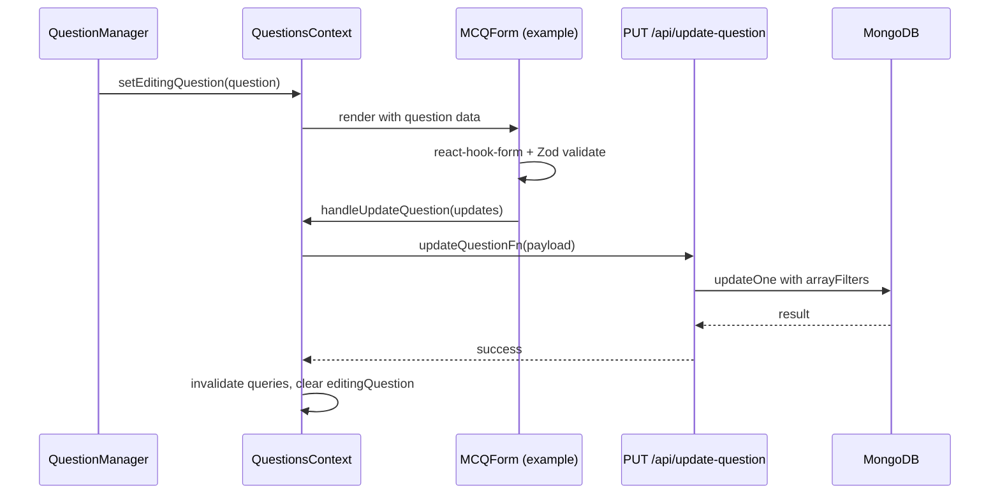

# 03 — Components & Data Flow

## Component hierarchy

### Global

```
NavBar
  ├── Logo + nav links (absolute paths from DashboardPagePath)
  ├── Login / Logout button
  └── Avatar dropdown (admin profile from localStorage, version from package.json)
```

### User management

```
create-user/page.tsx
  └── CreateUserForm
        ├── react-hook-form + Zod
        ├── Course/topic checkboxes
        └── Side panel: recently created users (localStorage)

users-overview/page.tsx
  ├── Search input + pagination controls
  └── UserTable
        ├── Copy userid button
        └── Delete dialog + mutation
```

### Question management

```
questions/page.tsx
  └── QuestionManager
        ├── Course selector (dropdown)
        ├── Topic tabs
        ├── Module sidebar
        ├── Question list
        ├── QuestionRenderer (view mode)
        └── QuestionEditor (edit mode)
              └── Type-specific form (MCQForm, MSQForm, ...)
                    └── FormActionButtons (Cancel / Save)
```

## Data flow: edit a question



## shadcn/ui usage

Primitives in `src/components/ui/` — generated via shadcn CLI (`components.json`).

Commonly used: `Button`, `Input`, `Dialog`, `Table`, `Checkbox`, `Field`,
`DropdownMenu`, `Pagination`, `Spinner`, `Textarea`, `Switch`, `RadioGroup`.

Add new primitives with:

```bash
npx shadcn@latest add <component>
```

## NavBar auth gating

NavBar reads `useAuth()` and conditionally shows:

- Login link when `!isAuthenticated`
- Manage links + avatar dropdown when authenticated
- Hides manage links while `isLoading`

Middleware is the real gate for `/manage/*`; NavBar is cosmetic gating.

## Toast notifications

`sonner` via `toast()` from any client component. `<Toaster />` in root layout.

## Register page outlier

`/register` uses inline styles instead of Tailwind/shadcn. Treat as legacy when
making UI changes — align with the rest of the app if touching it.
