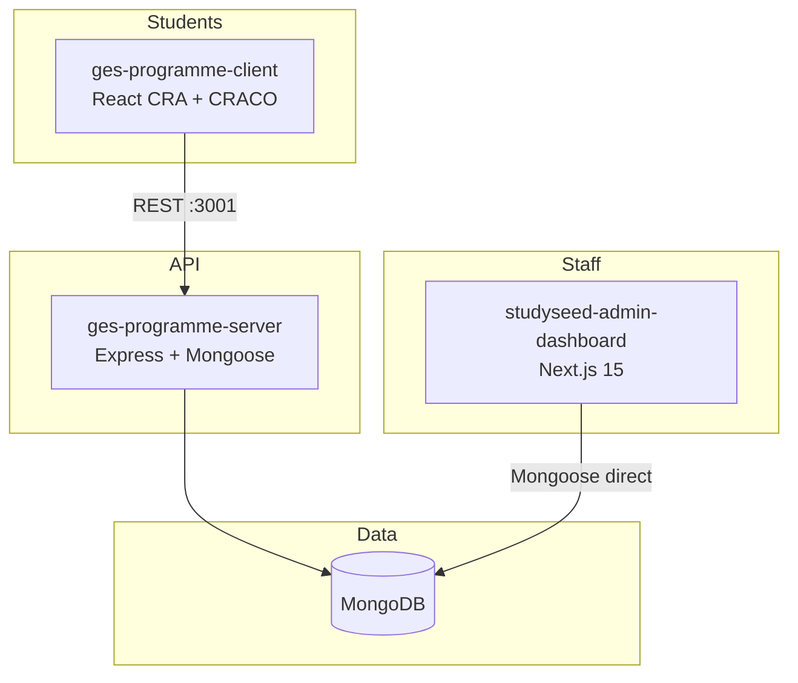
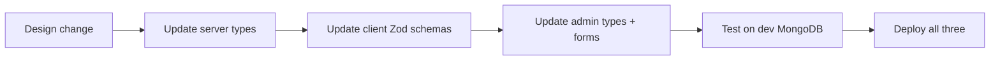

# 08 — Ecosystem Integration

How this dashboard fits alongside `ges-programme-client` and
`ges-programme-server`.

## Three-repo architecture



| Repo | Port (dev) | Audience | DB access |
| --- | --- | --- | --- |
| ges-programme-client | 3000 | Students | Via server API |
| ges-programme-server | 3001 | API layer | Mongoose |
| studyseed-admin-dashboard | 8000 | Staff | Mongoose direct |

## Shared contracts

### Users collection

Both admin and server read/write `users`. Field names must match:

```
userid, first_name, last_name, enrolled_courses, courses (topics),
progress, avatar, unlockedAvatars
```

**Admin creates** → **Server authenticates** → **Client displays**.

Progress is written by the client (via server `PUT /mdb-update/progress`), never
by the admin dashboard.

### Question collections

Identical collection names and document structure. Admin edits are immediately
visible to server's `getQuestions()` and client's quiz runner.

### Branding

- Studyseed blue `#3380fc`, orange `#f58439`
- ImageKit CDN `ik.imagekit.io/jbyap95`
- SSGLP ticket references in CHANGELOGs (`ssglp-*`)

## ges-programme-client patterns to mirror

The client underwent a Phase 1–4 hardening project (2026-06). Relevant patterns
worth adopting in the admin dashboard:

| Client pattern | Admin status | Recommendation |
| --- | --- | --- |
| Zod at API boundary | Forms only | Add to Route Handlers |
| Centralized `network-functions.ts` | Partial (`updateQuestionFn` only) | Expand or keep inline fetch |
| `queryKeys.ts` centralization | Keys inline in components | Extract to `lib/queryKeys.ts` |
| `ApiError` class | None | Add for consistent error handling |
| MSW test mocks | None | Add for API route tests |
| `.env.example` | Was missing | Added |
| CI: lint + build + test | Test only | Expand CI |
| Engineering guide docs | Was missing | Added (this docs set) |

## ges-programme-server patterns to mirror

| Server pattern | Admin status |
| --- | --- |
| `src/types/question.ts` interfaces | `lib/questionTypes.ts` — keep in sync |
| `userid` unique index | Missing in admin User model |
| Pre-save progress hook | Admin uses client-side `initializeProgress` |
| `streak_choice` type | Missing in admin |
| `MACKLE` course | Admin-only (server lacks it) |
| `Course.ADMIN` questions | Not managed here |

## Sync workflow for schema changes



**Order matters:** server is the runtime authority for the game. Admin writes
must not introduce fields the server cannot read.

## Deployment notes

- Admin dashboard: typically Vercel (Analytics dependency suggests this).
- Game client: Netlify.
- Game server: separate Node host.

All three must point to the **same MongoDB** in each environment (dev/staging/prod).

## When to route through ges-programme-server instead

Consider proxying admin writes through the Express API if:

- You need a single validation layer for all writers.
- You want audit logging centralized on the server.
- You plan to add role-based permissions shared across services.

Current direct-MongoDB approach is simpler but duplicates validation logic.
